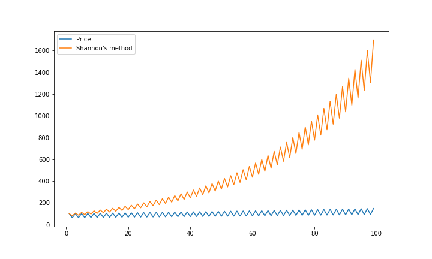

# Shannon's strategy
Claude Shannon, a mathematician and an electrical engineer, talked about a strategy that benefits from volatility (source: here). The strategy works by rebalancing the investment portfolio at every specific period. Our goal is to implement his strategy and find out in what condition it would be profitable.

